# FINMATH 36701 — Homework 4 Writeup

## Q1: GAN training and basic evaluation

### Experimental setup (brief)

| Ticker | Training months        | lr_G   | lr_D   | Batch size | Epochs | Seed |
|--------|------------------------|--------|--------|------------|--------|------|
| 0050   | 2023-10, 2023-11, 2023-12 | 0.00375 | 0.00100 | 50         | 200    | 307  |
| 0056   | 2023-10, 2023-11, 2023-12 | 0.00375 | 0.00100 | 50         | 200    | 307  |
| 2330   | 2023-10, 2023-11, 2023-12 | 0.00300 | 0.00100 | 50         | 200    | 307  |

The learning rates were tuned to get stable, non-divergent adversarial training; 2330 uses a slightly lower generator rate because higher rates produced more unstable losses.

### Training behavior (loss curves)

From the loss CSVs for each ticker, the trajectories look numerically as follows:

| Ticker | train_g (start → end) | eval_g (start → end) | train_d (start → end) | eval_d (start → end) | Interpretation |
|--------|------------------------|-----------------------|------------------------|-----------------------|----------------|
| 0050   | 1.29 → ≈1.08           | ≈1.12 → ≈0.98         | ≈0.25 → 0.19–0.23      | ≈0.25 → 0.19–0.23     | Smooth decline in generator losses and small drop in discriminator losses suggest a stable training regime without mode collapse or divergence. |
| 0056   | ≈1.11 → 0.79–0.81      | ≈0.98 → 0.66–0.72     | ≈0.25 → 0.22–0.30      | ≈0.25 → 0.25–0.29     | Generator losses fall more sharply while discriminator losses drift slightly upward, indicating the discriminator remains competitive but does not overpower the generator. |
| 2330   | ≈0.48 → 0.18–0.20      | ≈0.49 → 0.22–0.26     | ≈0.25 → 0.29–0.30      | ≈0.25 → 0.29–0.30     | Generator losses drop substantially and discriminator losses rise modestly, consistent with a stronger generator that still faces a non-trivial discriminator. |

Across all three tickers, losses evolve smoothly (no spikes to huge values or collapses to 0), and generator losses move from higher initial levels into lower, more stable ranges. Discriminator losses shift from their initial 0.25 baseline into new but still moderate bands, indicating that the adversarial game has settled into a reasonably stable regime rather than diverging.

**Figures (loss curves and return distributions)**

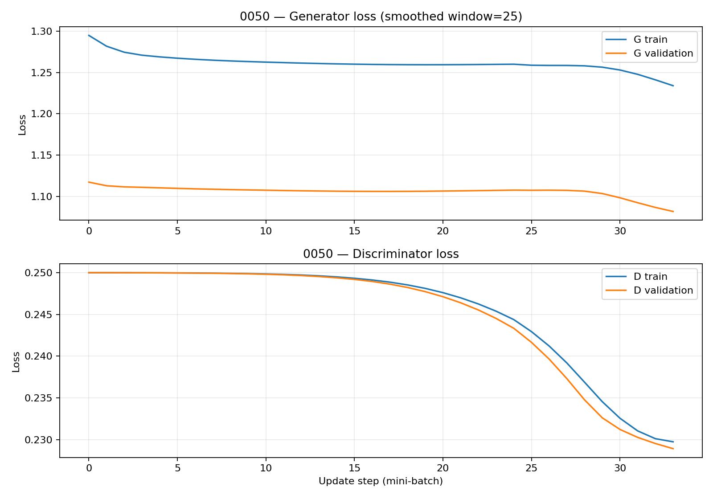

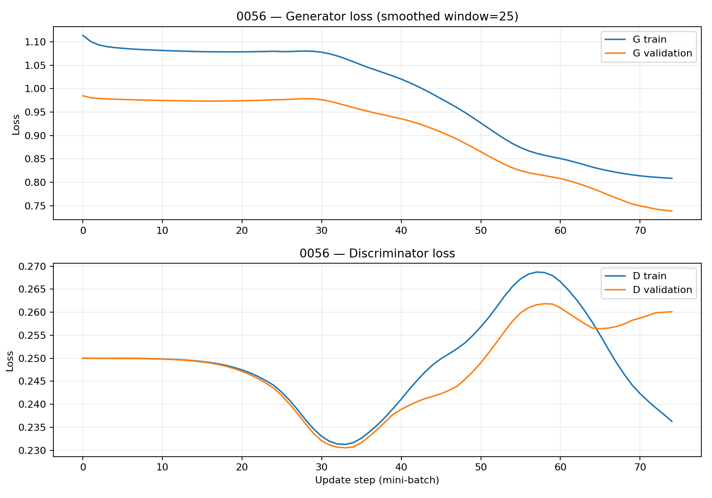

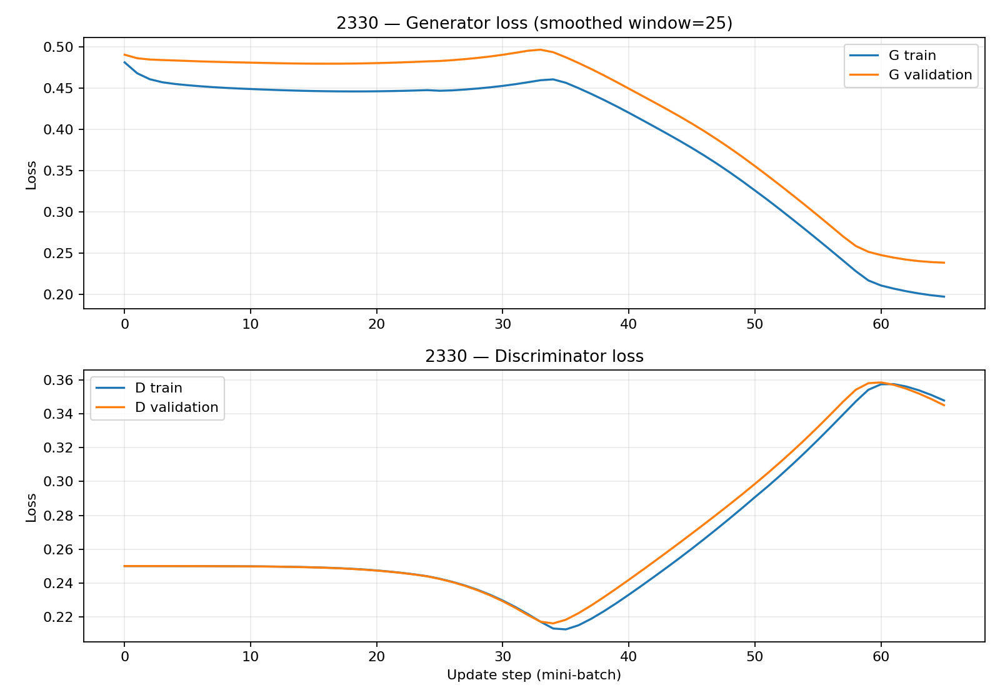

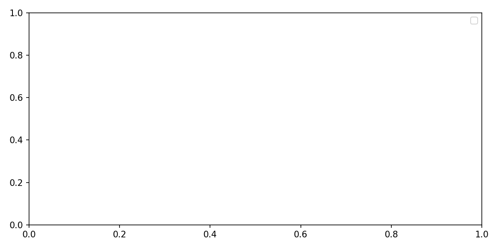

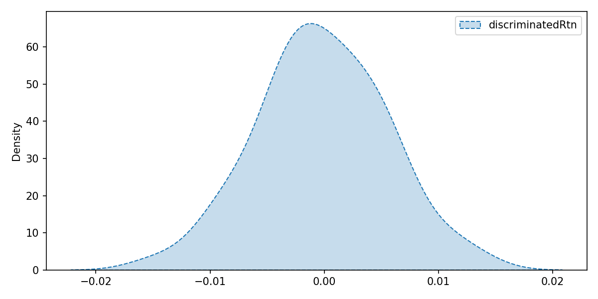

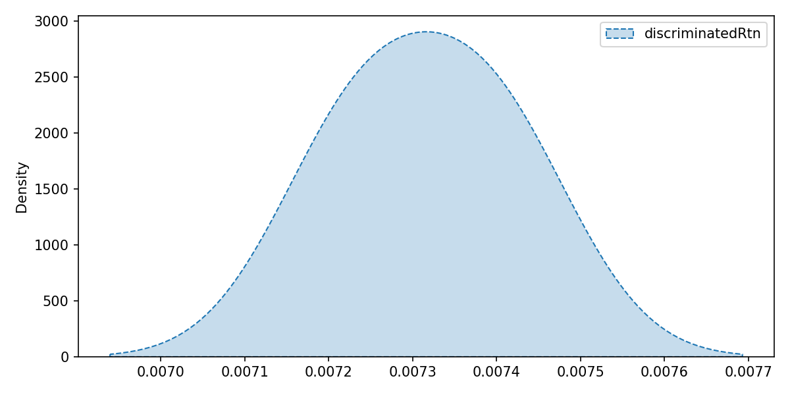

### Distributional behavior of returns

From the return-comparison figures (real vs synthetic) for each ticker:

- For 0050 and 0056, synthetic intraday returns cluster in roughly the same **±0.5%–1%** region as the real returns, with only slightly lighter tails.
- For 2330, the synthetic distribution again matches the bulk (central mass) of the empirical distribution but appears to under-represent the most extreme positive and negative returns.

Interpretation: the GAN captures the first-order behavior of returns (location and scale) reasonably well for all three tickers, but it is less accurate in reproducing rare, large moves. This is consistent with many GAN applications, where tail events are difficult to learn from finite samples.

---

## Q2: Discriminator-based anomaly detection and microstructure comparison

### Conceptual setup

The trained discriminator assigns a scalar score to each trading day’s 265×20 LOB tensor. Real days with **low scores** are interpreted as **abnormal**, in the sense that their dynamics look less like the bulk of the training data. Using a threshold of 0.5:

- Days with scores ≤ 0.5 are labeled **abnormal**.
- Days with scores > 0.5 are labeled **normal**.

On top of this labeling, we look at minute-level microstructure variables and compare their empirical distributions across abnormal vs normal days.

### Microstructure variables

For each minutely snapshot, the following variables are examined:

- **Trade price return:** within-day percent change of the last trade price.
- **Midquote return:** within-day percent change of the midquote.
- **Trade size.**
- **Bid-ask spread:** SP1 − BP1.
- **First difference of spread:** one-step change of the spread within a day.
- **Order-flow pressure at level 1:** (BV1 − SV1) / (BV1 + SV1).
- **Order-flow pressure at levels 1–5:** 
  (∑ BVi − ∑ SVi) / (∑ BVi + ∑ SVi) over levels i = 1,…,5.

### Interpretation of abnormal vs normal days

Key patterns from the summary statistics and KS tests can be summarized as follows.

**Returns (variance and KS tests)**

| Ticker | Variable              | Abn. var          | Norm. var         | KS stat | KS p‑value      |
|--------|-----------------------|-------------------|-------------------|---------|-----------------|
| 50     | trade_price_returns   | 2.14×10⁻⁷         | 1.87×10⁻⁷         | 0.165   | 1.2×10⁻⁶        |
| 2330   | trade_price_returns   | 9.88×10⁻⁷         | 1.09×10⁻⁶         | 0.103   | 3.8×10⁻⁵        |

These rows show that the return distributions on abnormal days differ measurably from those on normal days, mainly via changes in variance and tails, with KS tests strongly rejecting equality.

**Spreads**

| Ticker | Variable        | Abn. mean | Norm. mean | KS stat | KS p‑value |
|--------|-----------------|-----------|------------|---------|-----------:|
| 50     | bid_ask_spread  | 0.0696    | 0.0675     | 0.042   | 0.74       |
| 56     | bid_ask_spread  | 0.0108    | 0.0125     | 0.107   | 0.005      |

For 56, abnormal days exhibit a clearly different spread distribution (despite a slightly smaller mean), while for 50 the mean difference is smaller and the KS test is not significant.

**Trade size (means and KS tests)**

| Ticker | Abn. mean size | Norm. mean size | KS stat | KS p‑value |
|--------|----------------|-----------------|---------|-----------:|
| 50     | 238            | 722             | 0.019   | ≈1.0       |
| 56     | 8,713          | 2,279           | 0.033   | 0.93       |

Trade size is extremely heavy‑tailed in both groups; even with large mean differences, the KS tests indicate that size alone does not sharply separate abnormal from normal days.

**Order‑flow pressure (level 1 and 5)**

| Ticker | Variable          | Abn. mean | Norm. mean | KS stat | KS p‑value    |
|--------|-------------------|-----------|------------|---------|--------------:|
| 50     | pressure_level_5  | 0.107     | 0.060      | 0.167   | 8.2×10⁻⁷      |
| 56     | pressure_level_1  | 0.125     | −0.143     | 0.195   | 4.0×10⁻⁹      |
| 2330   | pressure_level_5  | 0.046     | −0.138     | 0.376   | 2.1×10⁻⁶⁵     |

Order‑flow pressure metrics show some of the strongest differences between abnormal and normal days: means often change sign or magnitude substantially, and KS p‑values are extremely small, especially for 2330.

Overall, abnormal days, as identified by the discriminator, tend to be those with:

- Measurably different return dynamics (variance and tails),
- Distinct spread distributions for some tickers, and
- Very pronounced changes in order-flow pressure, particularly at the 5-level aggregate.

These properties are economically plausible characteristics of “unusual” trading days, reinforcing the idea that the discriminator is capturing meaningful deviations from typical market conditions rather than pure noise.

---

## Q3: Quality of synthetic order books

### High-level evaluation approach

The generator is evaluated by comparing **real vs synthetic order books** at both the day and snapshot levels, for the test months 2024-01 to 2024-03 and all three tickers.

### Visual diagnostics: spreads, pressures, and depth

From representative days and snapshots:

- **Spreads:**
  - For 0050, on days like **2024-01-02** and **2024-03-29**, synthetic spreads are of similar magnitude to real spreads and broadly follow intraday patterns such as higher spreads near the open and close and narrower spreads mid-session.
  - For 0056 and 2330, the same qualitative pattern holds, but the synthetic series are visibly smoother, with fewer abrupt jumps.

- **Order-flow pressures:**
  - Real and synthetic pressure_1 and pressure_5 series occupy similar numeric ranges and show comparable volatility across the 265 minutes.
  - The generator reproduces broad swings between buy- and sell-dominant order flow, though the timing and exact amplitudes of swings do not match one-for-one.

- **Depth curves:**
  - For most snapshots (e.g., minute 0, 132, and 264 on 0050-2024-01-02), synthetic bid and ask depth curves have realistic shapes: cumulative volume increases smoothly with distance from the midprice, and price levels are ordered as expected on each side.

**Example time-series comparisons (real vs synthetic)**

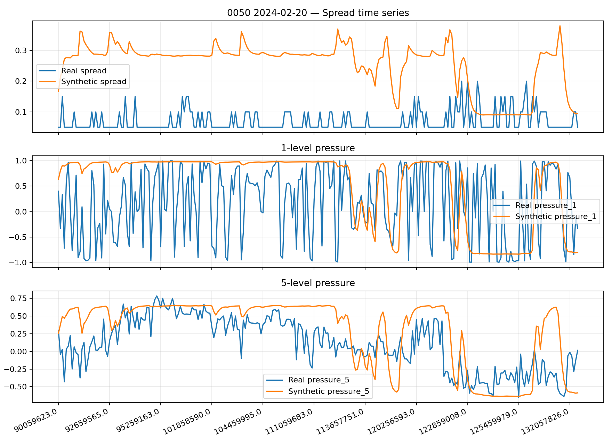

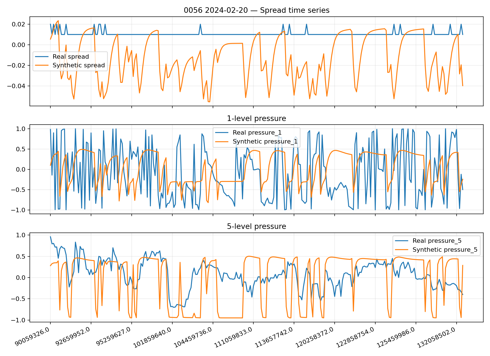

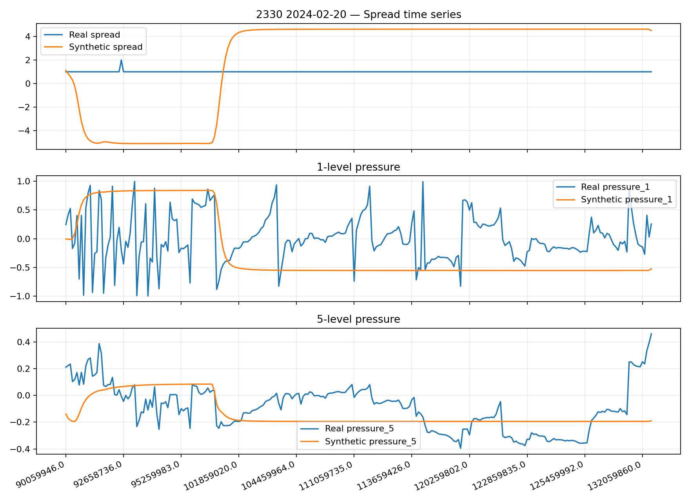

**Example depth snapshots (real vs synthetic)**

*Structurally clean case — 0050, 2024-01-02*

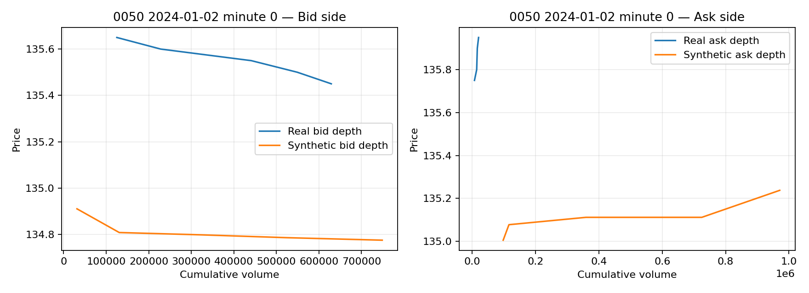

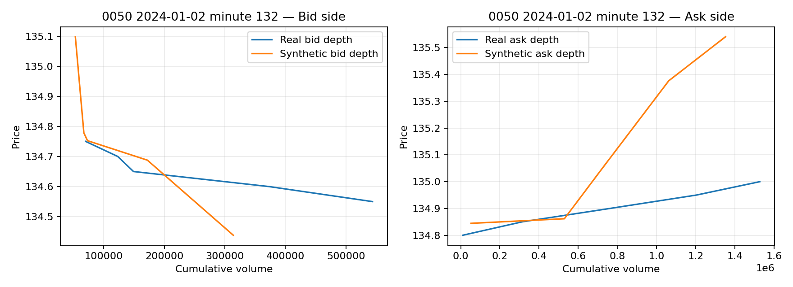

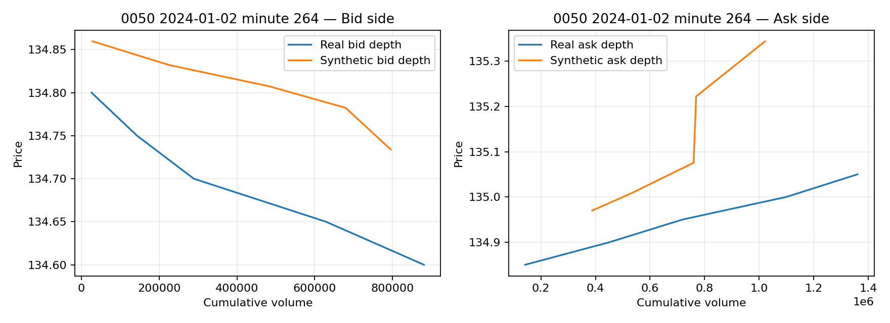

*Structurally problematic case — 0056, 2024-02-20*

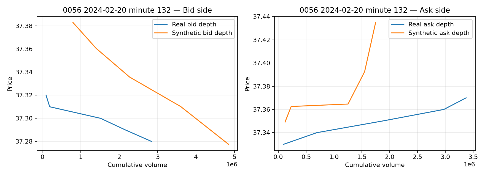

### Structural diagnostics

Key structural properties for three representative days per ticker are:

| Ticker | Date       | frac_crossed_book | frac_neg_vol | frac_ask_mono | frac_bid_mono |
|--------|------------|-------------------|--------------|---------------|---------------|
| 0050   | 2024-01-02 | 0.00              | 0.00         | 0.0075        | 0.00          |
| 0050   | 2024-02-20 | 0.00              | 0.00         | 0.00          | 0.00          |
| 0050   | 2024-03-29 | 0.00              | 0.00         | 0.00          | 0.00          |
| 0056   | 2024-01-02 | 0.68              | 0.00         | 0.00          | 0.00          |
| 0056   | 2024-02-20 | 0.64              | 0.00         | 0.00          | 0.00          |
| 0056   | 2024-03-29 | 0.73              | 0.00         | 0.00          | 0.00          |
| 2330   | 2024-01-02 | 0.26              | 0.00         | 0.0415        | 0.75          |
| 2330   | 2024-02-20 | 0.25              | 0.00         | 0.0113        | 0.00          |
| 2330   | 2024-03-29 | 0.21              | 0.00         | 0.0151        | 0.0113        |

Interpretation:

- For 0050, the generator respects basic structural constraints almost perfectly: no crossed books, no negative volumes, and very rare monotonicity violations.
- For 0056, the generator produces a **large fraction of crossed books** (more than 60% of minutes), which is a serious structural deficiency, even though volumes remain non‑negative.
- For 2330, crossed-book frequencies are lower than for 0056 but still substantial (about 20–26% of minutes), and ask monotonicity is only occasionally satisfied, although bid monotonicity is good on one of the three days.

### Overall assessment

Putting the visual and structural evidence together:

- The GAN produces **structurally coherent** synthetic books for 0050 (and partly for 2330) in terms of non-negative volumes and mostly non-crossed quotes, and it captures **coarse intraday patterns** in spreads and order-flow pressures for all three tickers.
- However, the very high crossed-book fractions for 0056 and the non-trivial crossed-book rates for 2330 highlight that the generator does not uniformly respect price ordering constraints across all instruments.
- It also tends to **smooth out extreme or very short-lived events**, and tail behavior in prices and liquidity remains somewhat under-represented.

From an assignment perspective, these diagnostics show both the **strengths** (0050 in particular) and **limitations** (notably 0056) of the trained GAN as a tool for generating realistic intraday LOB scenarios and suggest that adding explicit structural penalties or constraints could meaningfully improve realism.
